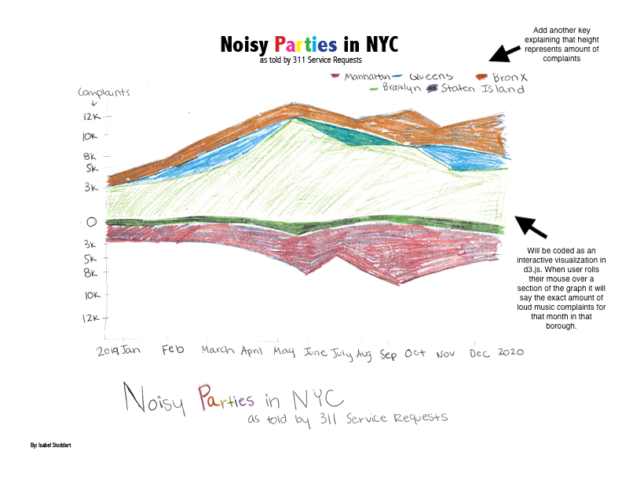
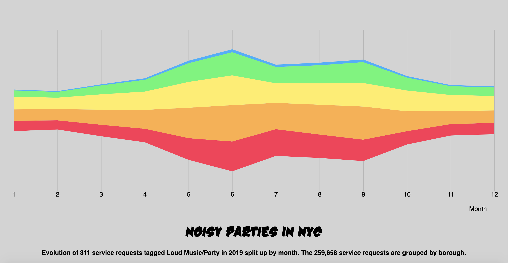
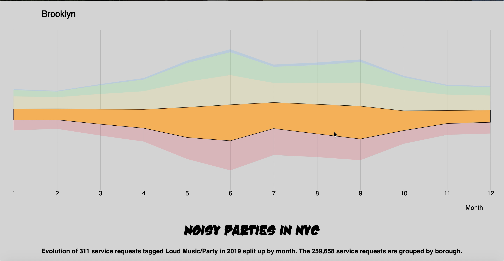

# Noisy Parties in NYC
A project completed for Data Visualization and Information Aesthetics at Parsons School of Design

## [Live Project](https://isabelstoddart.github.io/NoisyPartiesNYC/)

### Goal
The goal of this project was to visualize 311 calls in NYC. I decided to visualize just the calls tagged with the complaint "Loud Music/Party" to investigate when the most loud music complaints occur. I looked at complaints per month in the year 2019. I wanted to stay away from 2020 because I assumed the complaints could be biased due to the pandemic, so I decided to use 2019. The complaints are split up into the 5 boroughs. 

### Iteration 1
My first iteration was a sketch of what I invisioned the final product to look like. I decided to use a stream graph for this visualization to clearly show the evalution of noise complaints throughout the year.

### Iteration 2
My second iteration turned my initial sketch into code. 

You can find the current iteration of this project at: https://isabelstoddart.github.io/NoisyPartiesNYC/
